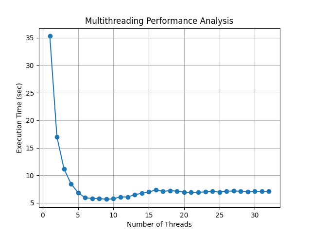
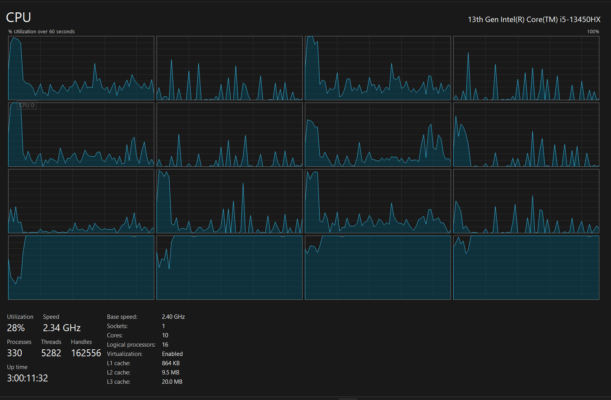

# Multithreading Matrix Multiplication – Performance Analysis

## 1. Aim
To analyze the impact of multithreading on the execution time of matrix multiplication and understand performance scaling with increasing number of threads.

---

## 2. System Configuration
- Processor: Intel i5-13450HX  
- Physical Cores: 10  
- Logical Processors: 16  
- Matrix Size: 2400 × 2400  
- Threads Tested: 1 to 32  

---

## 3. Problem Statement

Matrix multiplication is a computationally intensive operation with time complexity:

T(N) = O(N³)

For large matrices, sequential execution becomes slow.  
Multithreading allows parallel execution by dividing work among multiple CPU cores.

---

## 4. Parallelization Strategy

### 4.1 Work Division
- Each thread is assigned a subset of matrix rows
- All threads execute concurrently
- Final matrix is constructed by combining results

### 4.2 Thread Model
- Number of threads varied from 1 to 2 × number of logical processors
- Static partitioning: each thread processes approximately N / T rows

---

## 5. Theoretical Background

### 5.1 Ideal Speedup (Amdahl’s Law)

Speedup S is defined as:

S = T(1) / T(T)

According to Amdahl’s Law:

S(T) = 1 / [(1 - P) + (P / T)]

Where:
- P = fraction of parallelizable work
- T = number of threads

 Even with infinite threads, speedup is limited by the sequential portion.

---

### 5.2 Scalability Behavior

In an ideal system:
- Doubling threads → halves execution time

In reality:
- Speedup is sub-linear due to overheads

---

## 6. Experimental Observations

### Phase 1: Sequential Region (T = 1)
- Execution time is maximum (~35 sec)
- Only one core is utilized

---

### Phase 2: Parallel Speedup (T = 2 to 8)
- Significant drop in execution time
- Work is efficiently distributed
- Near-linear speedup observed

---

### Phase 3: Optimal Region (T ≈ 8–10)
- Minimum execution time (~5.6 sec)
- Best utilization of CPU resources

---

### Phase 4: Saturation (T = 10–16)
- Performance gain slows down
- System resources become saturated

---

### Phase 5: Overhead Dominance (T > 16)
- Execution time increases (~7 sec plateau)
- Adding threads does not improve performance

---
## Performance Graph

The following graph shows the relationship between number of threads and execution time:

## 7. Why Performance Degrades

### 7.1 Context Switching
- CPU rapidly switches between threads
- Adds overhead and reduces efficiency

---

### 7.2 Thread Management Overhead
- Creating, scheduling, and synchronizing threads costs time

---

### 7.3 CPU Contention
- Limited cores must serve many threads
- Threads compete for execution time

---

### 7.4 Cache Effects
- Matrix multiplication is memory-intensive
- Multiple threads cause:
  - Cache misses
  - Cache invalidation
- Reduces performance

---

### 7.5 Memory Bandwidth Bottleneck
- All threads access shared memory
- Memory bandwidth becomes a limiting factor

---

## 8. CPU Usage Analysis

The CPU usage graph shows:
- Multiple logical processors active simultaneously
- Uneven load distribution across cores

This behavior is expected because:
- OS scheduler dynamically assigns threads
- Workload is not perfectly uniform
- Some threads complete earlier than others

---
## CPU Utilization

The following screenshot shows CPU usage across all logical processors during execution:

## 9. Key Insights

- Multithreading improves performance significantly up to an optimal point
- Optimal threads ≈ number of available cores (or slightly less)
- Beyond that, overhead outweighs benefits
- Real-world performance deviates from ideal due to system constraints

---

## 10. Conclusion

Multithreading provides substantial performance gains for compute-intensive tasks like matrix multiplication. However, performance does not scale indefinitely with increasing threads.

An optimal balance between parallelism and overhead must be maintained to achieve maximum efficiency.

---

## 11. Future Scope

- Implement using OpenMP for better thread management
- Compare performance with GPU-based computation (CUDA/OpenCL)
- Explore cache-optimized algorithms (block matrix multiplication)
- Study NUMA effects on multi-core systems

---

## 12. Files in Repository

- `code.cpp` → Multithreaded implementation  
- `results.txt` → Execution time data  
- `plot.py` → Graph generation script  
- `graph.png` → Performance graph  
- `cpu_usage.png` → CPU utilization screenshot  
